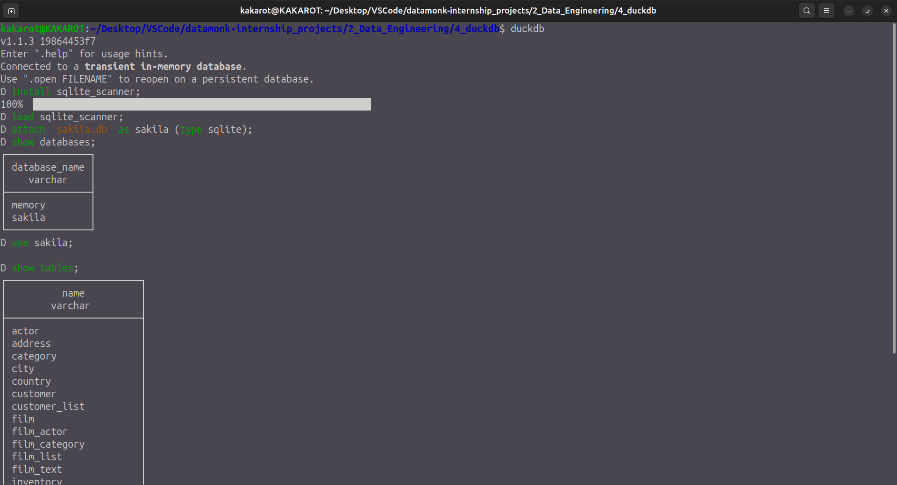
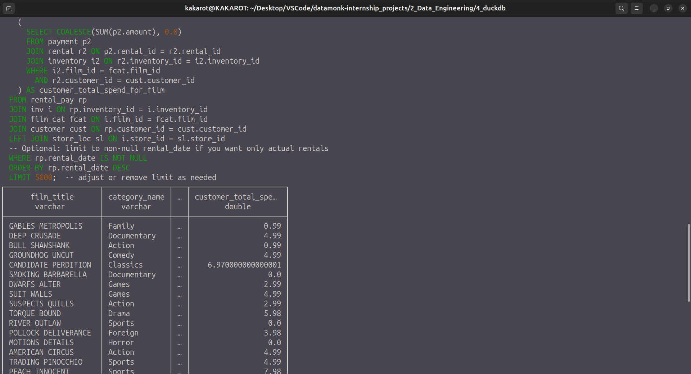
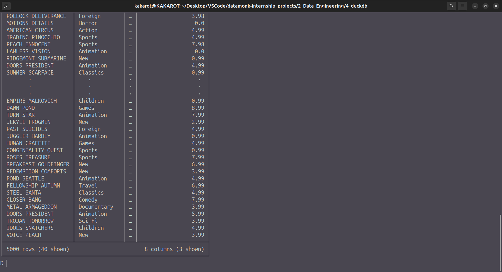
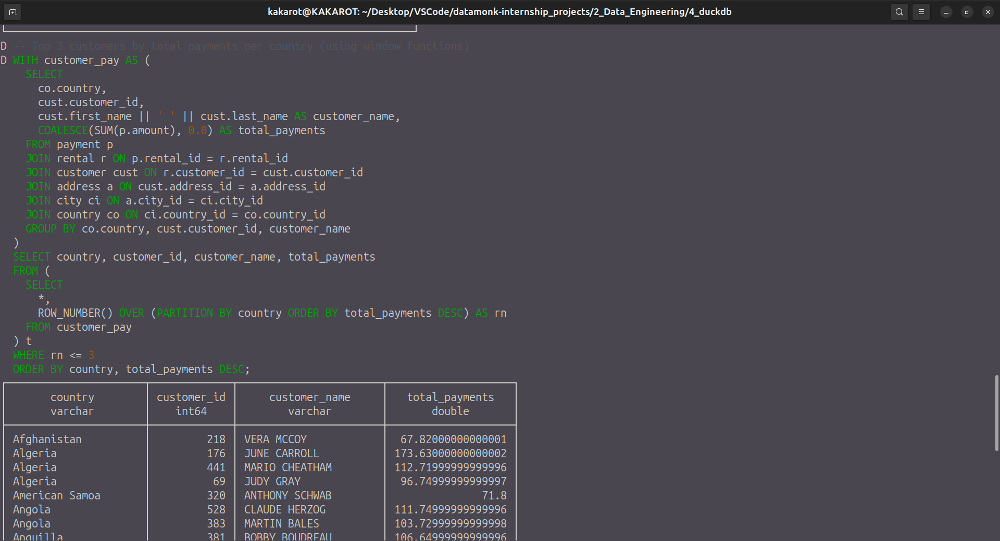
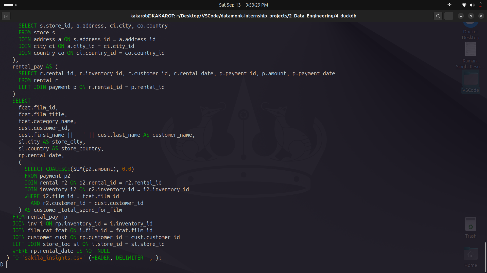
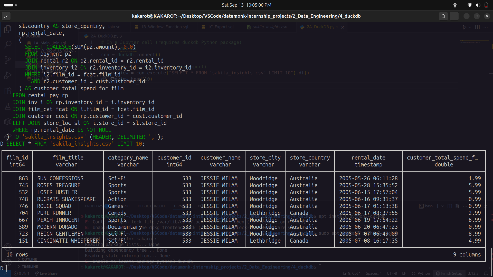
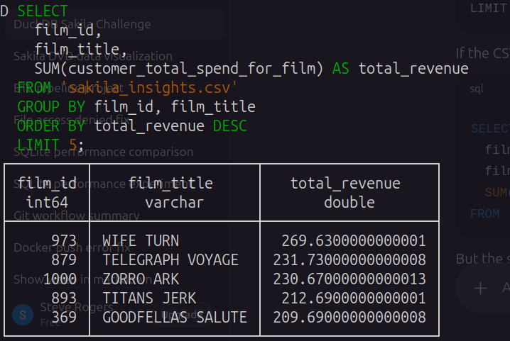
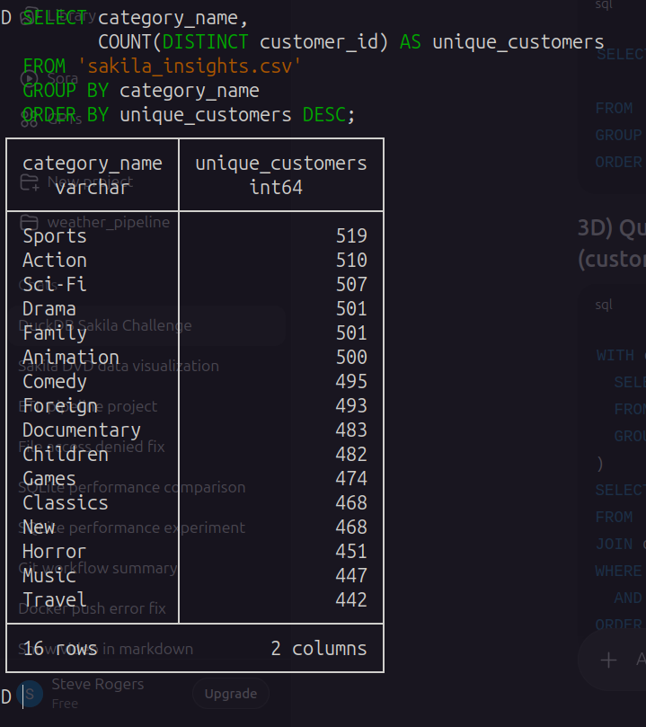
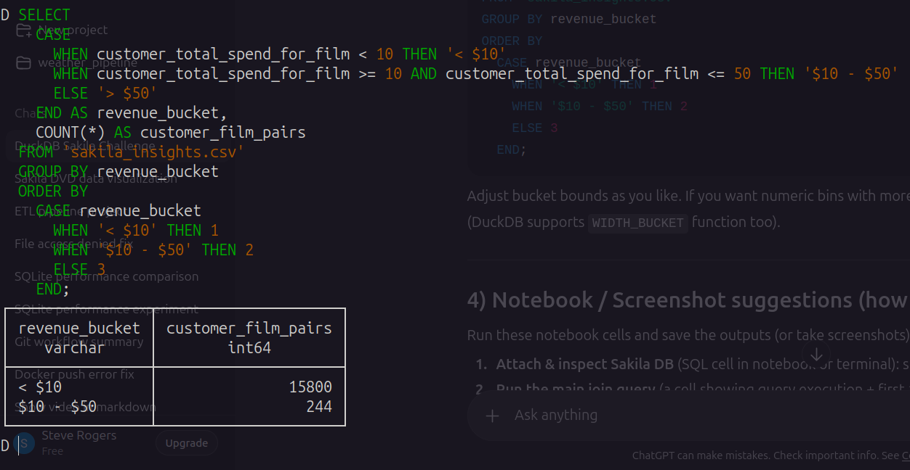

# DuckDB Sakila Advanced Analytics Challenge

## 📌 Overview
This project explores advanced SQL analytics using the **Sakila DVD Rental Database** inside **DuckDB**.  
It demonstrates how to:
- Run complex multi-table joins and subqueries in DuckDB.
- Export enriched query results to **CSV**.
- Treat the exported CSV as a **standalone dataset** for further analysis.

The challenge simulates real-world data engineering workflows:
1. Start with a normalized relational schema (Sakila DB).
2. Create analytical views with joins and aggregations.
3. Export results to a flat file for downstream analysis.
4. Query the flat file directly in DuckDB (without re-importing).

---

## ⚙️ Setup

### 1. Download Sakila SQLite DB
```bash
wget https://github.com/ivanceras/sakila/raw/master/sqlite-sakila-db/sakila.db -O sakila.db
```

### 2. Start DuckDB Shell
```bash
duckdb
```

### 3. Install & Load SQLite Extension
```sql
INSTALL sqlite_scanner;
LOAD sqlite_scanner;
```

### 4. Attach Sakila DB
```sql
ATTACH 'sakila.db' AS sakila (TYPE sqlite);
USE sakila;
SHOW TABLES;
```

You’ll see tables like:
`actor, customer, film, rental, payment, store, category, inventory`, etc.



---

## 🧩 Part 1 – Complex Queries on Sakila

### 1. Rentals with Film & Customer Details
Joins across **film, category, customer, store, rental, payment**  
Includes a correlated subquery computing **total spend per customer per film**.

**Output fields:**
- Film title  
- Category name  
- Customer full name  
- Store city & country  
- Rental date  
- Customer’s total spend for that film  



---




---

### 2. Top 3 Revenue Customers per Country
Two implementations provided:
- **Window function (ROW_NUMBER)**  
- **Correlated subquery**  



---

### 3. Export Results
```sql
COPY (
  SELECT ...
) TO 'sakila_insights.csv' (HEADER, DELIMITER ',');
```

Generated file: **[`sakila_insights.csv`](sakila_insights.csv)**




---

## 📊 Part 2 – Querying the Exported CSV

DuckDB allows querying CSVs directly:

```python
import duckdb
con = duckdb.connect()
con.execute("SELECT * FROM 'sakila_insights.csv' LIMIT 10").df()
```

### 1. **Top 5 films by revenue**



---
### 2. **Unique customers per category**




---
### 3. **Action films above category average revenue**



---
### 4. **Histogram buckets of total revenue (<$10, $10–$50, >$50)**




---

## Write-up: Working with Sakila in DuckDB

Exporting Sakila query results into a CSV fundamentally changed the way I approached the analysis.  
In the relational database, I relied on normalized joins (e.g., rental → payment → inventory → film) to compute insights.  
Once exported to CSV, the dataset became **denormalized** — all necessary fields (film, category, customer, store, spend) were pre-joined.  
This meant subsequent queries focused only on aggregation and filtering, without re-joining multiple tables.  
It simplified the logic, but also required care to avoid double-counting customer-film totals.

**Benefits of CSV in DuckDB:**
- Extremely portable and easy to share.
- Can be queried directly without importing, enabling instant exploration.
- Works seamlessly with DuckDB’s SQL engine.

**Limitations:**
- No schema enforcement (string vs numeric types may need casting).
- Larger storage footprint and slower scan vs columnar formats like Parquet.
- Loss of normalized structure — once exported, you can’t re-join to related tables unless you export them too.

Overall, the CSV workflow was great for lightweight analysis and portability, while the normalized Sakila DB remains more powerful for complex relational queries.


---
