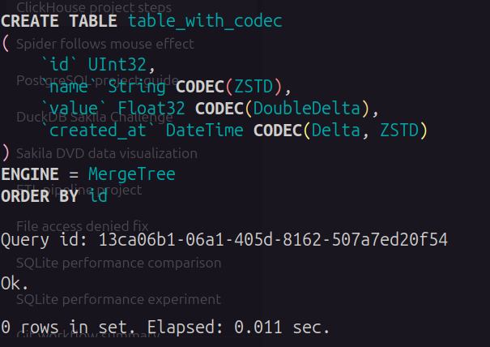
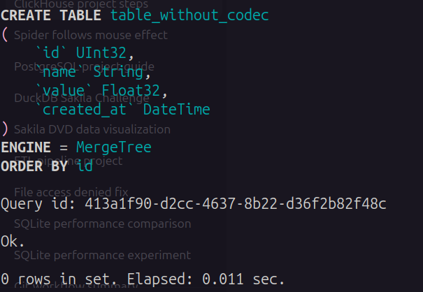
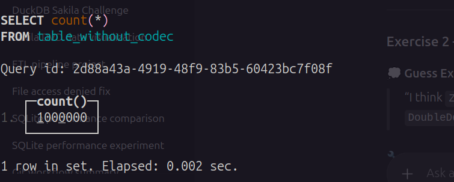

# ClickHouse Project — Data Engineering
Repository for DataMonk Internship Project

## Module 1: Data Compression
### Exercise 1 — Create Two Tables: With and Without Codecs

1. Create Table A (with codecs):

---

2. Create Table B (without codecs):

---

3. Insert 1 million rows:

---

4. Check sizes:

---

5. Check row counts:

---

### Exercise 2 — Guess the Best Codec
1. Create tables for testing codecs:

---

2. Insert data:

---

3. Compare disk usage:

---

## 🧱 Module 2: Columnar Storage
1. Load the same dataset (e.g., people.csv) into PostgreSQL and ClickHouse.

---

2. Run analytical query (e.g., average age per city):

---

## ⚡ Module 3: Why ClickHouse is Fast
### Exercise 3 — Test Isolated Inserts and Queries
- Terminal 1 (insert continuously using Python):

---

- Terminal 2 (run SELECT repeatedly):

---

### Exercise 4 — Experiment with ReplacingMergeTree
1. Create table:

---

2. Insert duplicates:

---

3. Check before merge:

---

4. Trigger merge:

---

5. Check after merge:

---

### Exercise 5 — Write a Vectorized Query
1. Insert data:

---

2. Run aggregation:

---
