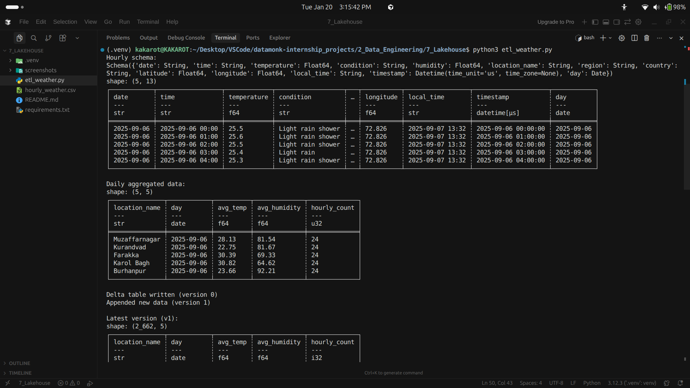
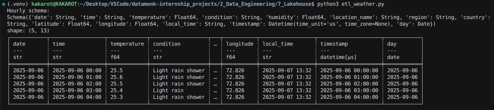
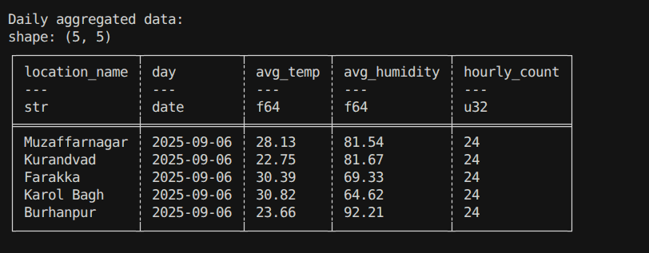
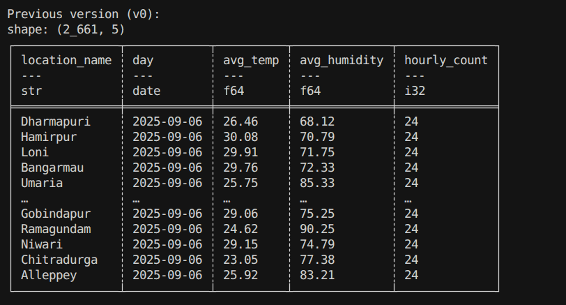
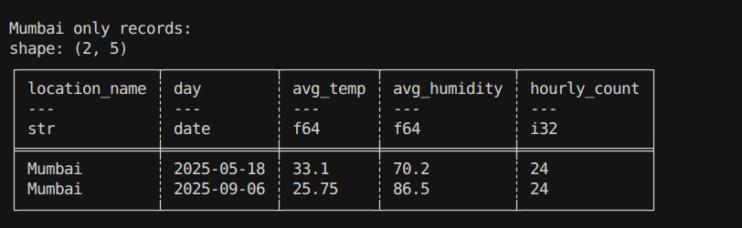
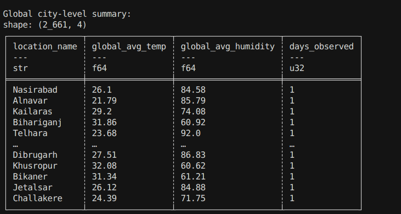

# Weather ETL using Polars + Delta Lake

## Overview
This project implements an end-to-end Weather ETL pipeline using:
- Polars for fast data processing
- Delta Lake for ACID-compliant, versioned storage

The pipeline recreates the earlier SQL-based ETL using a modern lakehouse architecture.

---

## Steps Performed

### 1. Load Hourly Weather Data
- Exported weather data from SQLite into CSV
- Loaded CSV using Polars
- Parsed timestamps and derived daily partitions

### 2. Hourly → Daily Aggregation
- Aggregated temperature and humidity per city per day
- Counted hourly records for data quality checks

### 3. Delta Lake Storage
- Stored daily aggregates as a Delta table (version 0)
- Used Parquet-backed storage with transaction logs

### 4. Append New Data
- Simulated new daily data
- Appended records, creating version 1+

### 5. Time Travel
- Queried historical versions using Delta Lake
- Compared version 0 and latest version

### 6. Partition Pruning & Filtering
- Filtered data by city
- Observed metadata-based pruning behavior

### 7. Global Aggregation
- Computed global averages per city
- Generated long-term climate summaries

---

## Observations

- Polars outperforms pandas significantly for aggregations
- Delta Lake provides reliable versioning and rollback
- Time travel enables auditing and reproducibility
- Metadata pruning minimizes IO during filtered queries

---

## Screenshots
- Appending multiple versions

  
- Time travel comparisons

  
- City-based filtering

  
- Overwrite before/after comparison

  

